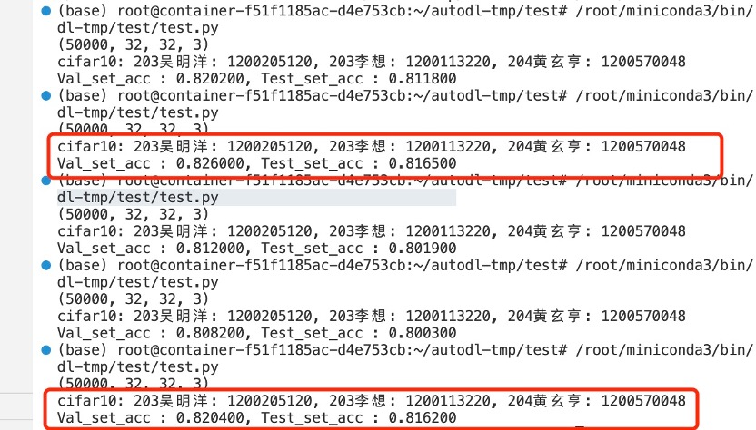

# Optimized CNN

Here is the improved version:

## Timeline

2022.12: Project initiation aimed at enhancing the effectiveness of testing.

2023.3.6: The original code has been improved, resulting in enhanced results. I will upload the modified code.

2023.3.10: I uploaded the code for forward inference of the model.

## Improvements

The following improvements were made:

### Basic methods

1. Adapted a single-layer convolutional architecture and built a [VGG-like](https://arxiv.org/pdf/1409.1556.pdf) architecture model using [NumPy](https://numpy.org/).

2. Implemented convolution, backpropagation, and parameter updates, among others.

### Optimization

1. Introduced regularization techniques such as [Dropout](https://jmlr.org/papers/v15/srivastava14a.html), [L2 regularisation](https://towardsdatascience.com/l1-and-l2-regularization-methods-ce25e7fc831c), and initialization of weights using the [He_Normal](https://blog.csdn.net/vcvycy/article/details/79436379) method.

2. Introduced data augmentation methods such as real-time data augmentation to derive optimal parameters.

3. Optimized convolution calculations using the [im2col algorithm](https://leonardoaraujosantos.gitbook.io/artificial-inteligence/machine_learning/deep_learning/convolution_layer/making_faster).

4. Migrated the model to GPU for computation using [Cupy](https://cupy.dev/), resulting in a hundred-fold speedup in training.

5. Selected [Adam](https://arxiv.org/pdf/1412.6980.pdf) as the optimizer after debugging.

6. Abandoned [Batch Normalization](https://arxiv.org/pdf/1502.03167.pdf).

### Performance results

Improved the classification accuracy of the [CIFAR-10](https://www.cs.toronto.edu/~kriz/cifar.html) dataset from 53% to 81.6%.

note : If I have infringed upon any rights, you can contact me at any time.

## Reference
1. [code from cs231n](http://cs231n.stanford.edu/)